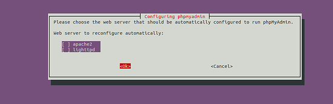

# Install PhpMyAdmin with Nginx on Ubuntu 18.04
Published at: 20/04/2020
---

PhpMyAdmin is the most popular web interface for MySql whereas nginx is becoming a popular choice for web server. Here we will be going thourgh the process of setup a PhpMyAdmin instance with Nginx, in an Ubuntu 18.04 server. The steps may vary slightly for other ubuntu versions.

## Setup PhpMyAdmin 
- We are assuming php, mysql, nginx are already installed in the Ubuntu system
- Install PhpMyAdmin
```
sudo apt-get install phpmyadmin
```
- During installation, below screen will appear & ask to choose web server


As we will be using Nginx as web server, don't select any of the options & enter "Ok"
- In next steps, a new database user for PhpMyAdmin will be created & a database named 'phpmyadmin' will be created as well
- After successful installation, phpmyadmin folder can be found at `/usr/share/phpmyadmin`. We will create a symlink to `/var/www/html` using following command
```
sudo ln -s /usr/share/phpmyadmin /var/www/html/phpmyadmin
```

## Create Nginx Server Block
- Create a server block file for phpmyadmin at `/nginx/sites-available/phpmyadmin` & put below content
```
server {
        root /var/www/html;

        # Add index.php to the list if you are using PHP
        index index.php index.html index.htm index.nginx-debian.html;

        server_name ***.**.***.*;

        location ~ \.php$ {
           include snippets/fastcgi-php.conf;
           fastcgi_pass unix:/var/run/php/php7.2-fpm.sock;
           fastcgi_param SCRIPT_FILENAME $document_root$fastcgi_script_name;
           include fastcgi_params;
       }
}
```
- Test nginx configuration by running `sudo nginx -t`. If no error found, restart nginx by `sudo service restart nginx`
- The phpmyadmin web interface will be available at `[Your_IP]/phpmyadmin` web address

### Change name of PhpMyAdmin folder for security
- As automated hacking attack can target the url [IP]/phpmyadmin, it is better practice to use some other name instead of phpmyadmin in the web link. 
- To do this, simply change the folder name in `/var/www/html` by command `sudo mv phpmyadmin mydb`
- After that the interface will be available at `[Your_IP/mydb]` web address

## Footnote
- There are many more steps regarding setup of Phpmyadmin with mysql & nginx, related to security & best practices. Please follow those as seem fit.